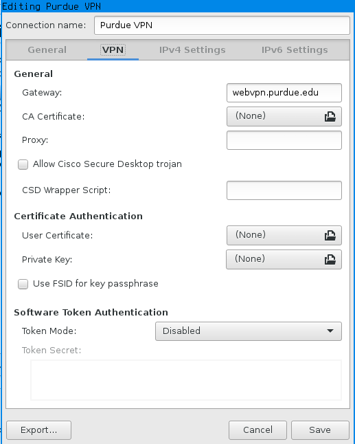

[[
title: VPN Tutorial
author: Evidlo
description: How to connect to the Purdue VPN
tags: [vpn, tutorial]
]]

# Install Openconnect

Network Manager needs the Openconnect plugin first.

Ubuntu/Debian

    sudo apt-get install network-manager-openconnect network-manager-openconnect-gnome

RHEL/Fedora

    sudo yum install NetworkManager-openconnect

Arch Linux
    
    sudo pacman -S install networkmanager-openconnect

#Configure

In Network Manager, go to

    VPN Connections > Configure VPN > Add

Then choose

   Cisco Anyconnect Compatible VPN

Enter the following settings:

Click save, and then activate the VPN in Network Manager.

    VPN Connections > [your vpn]

You will be prompted for a username and password on connecting. Use your Purdue Career Account username and BoilerKey password. 
